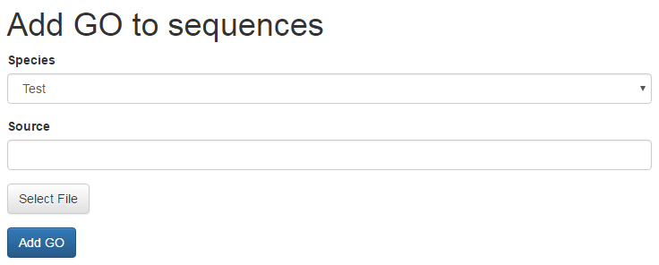

# Adding a new species and functional data

Adding a species requires multiple steps, follow the steps below for 
each species. 

## Adding the species and sequences

On the 'Admin panel', under 'Add' select 'Species'. Fill in the 
full scientific name (or the name you wish to appear on the website) for
the species and select a 'three letter code', that is unque for the
species (we recommend a combination of genus and species cfr. **H**omo 
**sa**piens = hsa, note that while three characters is recommended it is
not required, longer codes are possible). 

Some visualizations require a color specific for each species, these can 
be entered using the controls below (clicking the box opens a color 
picker, there is no need to manually add in hex values).

Finally, select a fasta file with **coding sequences**, in the fasta 
headers the gene name (and only the name) needs to be present. These are
the names genes will receive on the website.

```
>Gene1
ATG...
>Gene2
ATG... 
```

To upload the data and add the species to the database click 'Add species'

## Adding descriptions to sequences

In the 'Admin panel', under 'Add' -> 'Sequence descriptions'.

Select the **species** and a tab-delimited file containing on a single line the gene ID and
description (example below). Click **Add descriptions** to upload the file and add the 
description to the database.

```
gene01    gene01 description
gene02    gene02 description
gene03    gene03 description
...
```

Note: This step can be very time consuming if Whooshee indexing is enabled in your config! When
setting up a database with multiple species, consider disabling indexing while building the DB and
later enabling it + rebuilding the index (found under controls in the admin panel).

## Adding functional Annotation to sequences

**GO** terms can be imported from tab delimited files, containing 3 
columns: gene name, GO label and the evidence tag.

```
Gene1   GO:0004621  IEA
Gene1   GO:0004622  IEA
Gene2   GO:0000227  ISS
...
```

On the 'Admin panel', under 'Add' -> 'GO Genes' such a file can be 
uploaded, for a species. Additionally a description needs to be provided
from where the GO terms in the file originate from (the source). 
 


**InterPro** domains can be imported directly from [InterProScan](http://www.ebi.ac.uk/interpro/download.html) output. 
To do so, in the 'Admin panel', under 'Add' -> 'InterPro genes' select a species, select the file and click 'Add InterPro'

