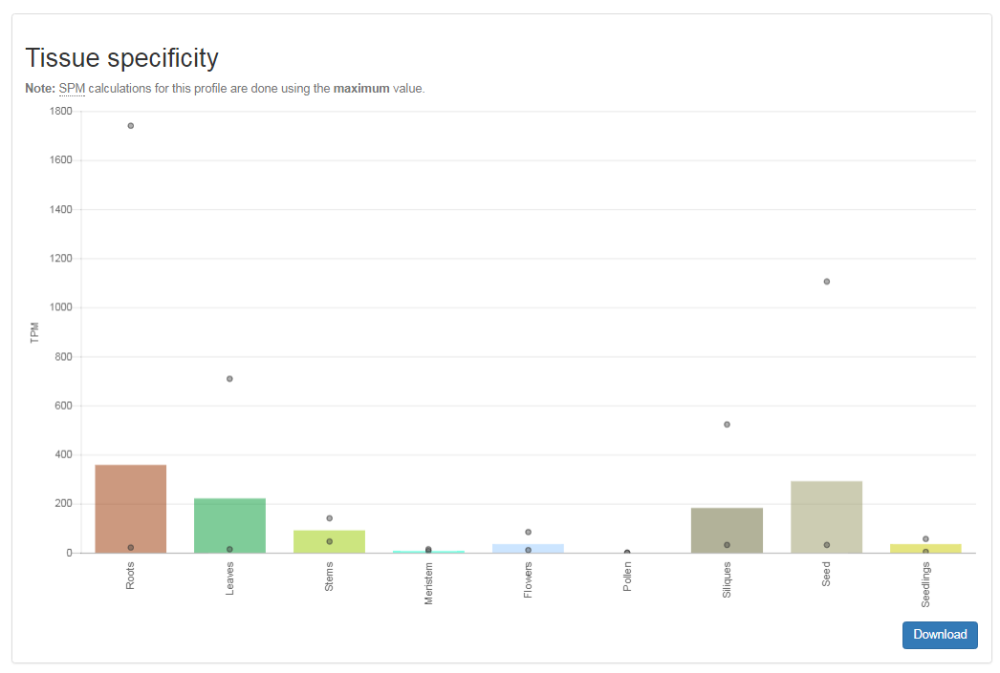
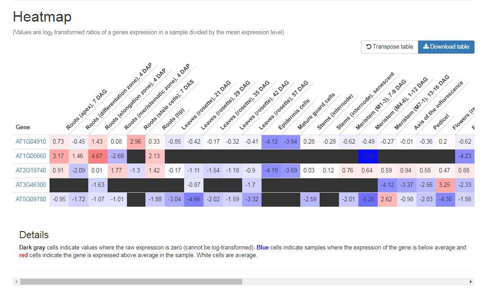
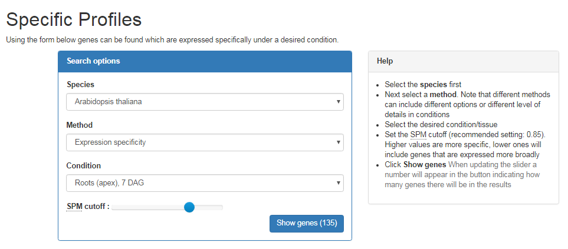
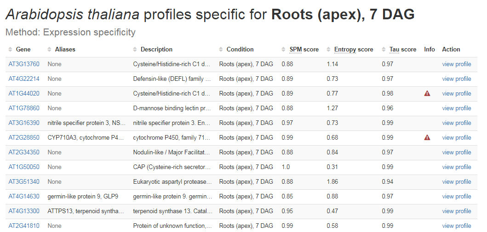

# Tutorial: Expression profiles, heatmaps and specificity

The key feature of CoNekT is the inclusion of thousands, carefully annotated, publicly available RNASeq samples
derived from the [Sequence Read Archive](https://www.ncbi.nlm.nih.gov/sra). For each gene a summary of its expression in
the annotated samples, the expression profile, is available. Data for a collection of genes can be used to create
heatmaps and by applying various statistics genes specific for certain conditions, tissues or organs can be detected.

## Expression Profiles

On the top of each sequence page you can see the expression profile, highlighting in which annotated samples the gene
is expressed and at which level. 

Furthermore, summarized profiles with fewer conditions are available (link below the plot). 

The **download** buttons below expression plots allow you to download the data from the plot in a tab-delimited text file.

Expression profiles can be compared between genes from the same species. From the tools menu select **Compare profiles**
in the Expression profiles section. On the next page select the species, enter gene identifiers and select if normalization
should be used (recommended). Click **Show profiles** to get a single plot including multiple genes.

 

Furthermore, links to compare profiles from genes 

## Heatmaps

While comparing expression profiles is limited to 50 genes, heatmaps can be used to compare larger sets of genes within
one species, or between species.

The tool to create heatmaps is located in the tools menu, **Create heatmap** in the expression profile section. First
select the correct tab, the default comparison will use all annotated condition but only allows genes from a single species
to be included. The Comparative heatmap allows comparisons between multiple species, but only for a limited set of conditions.
Depending on the type of heatmap you wish to create different normalization (or no normalization) options are available.

 

Hit **Generate heatmap** to create a heatmap for the selected genes. The heatmap can be transposed or stored locally using the
buttons in the top right. 

 

## Expression Specificity

To pick up genes expressed *specifically* in a certain tissue/condition the  **Find specific profile** function, under the
tools button in the menu, is available.  Select the **species**, the **method** (complete profile or a summary if any are 
available), the desired **tissue/condition** and **SPM-cutoff** (specificity metric). 

 

Note that if settings change, the number in the button **Show genes** is updated. This shows the number of genes in the
results. Once you have decided on the settings click that button to show the result.

An overview of genes specific for a certain tissue (here Root Apices, 7 days after germination). Note that by clicking
the table header the results can be sorted. Genes with an expression level below 10 TPM are flagged as low abundant, 
such low expressed genes should be treated carefully as they might comprise false positives !

By combining expression specificity with gene families (discussed in the [next section](003_gene_families_trees.md)) 
gene families with conserved specificity as well as sub- and neo-functionalized genes can be picked up as shown in 
[part](004_compare_specificity.md) 4 of this tutorial. 

## Export *all* expressed genes

To enable local analysis, all expressed genes in a certain condition/tissue can be exported using the 
**Export expression levels** feature under the tools button in the menu. Select the **species**, the **method** (full profile or
summary if any are available) and the **condition** you wish to export. Click **Export genes** to get the data. 

Note that exporting large sets of data can take up to a minute.