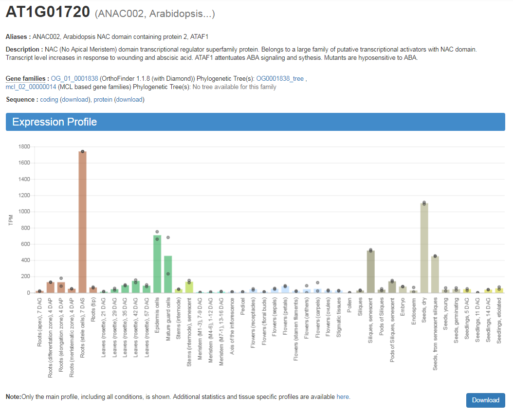
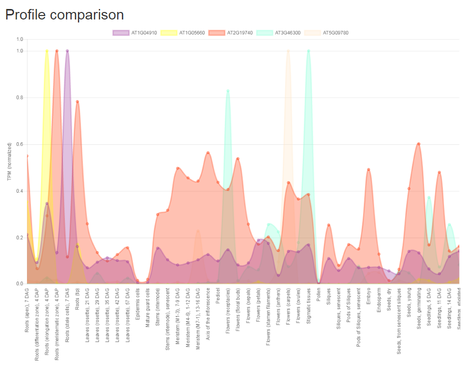
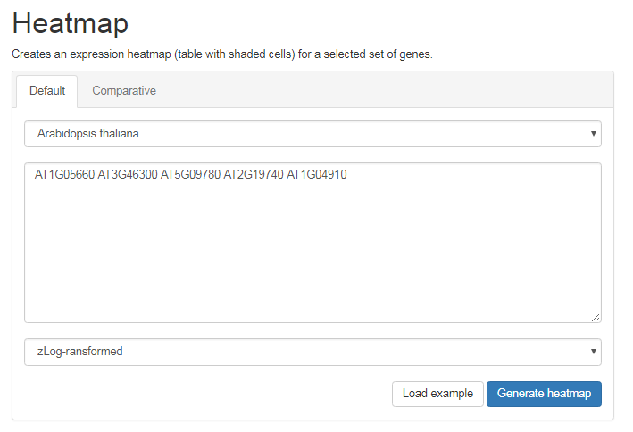

# Tutorial: Expression profiles, heatmaps and specificity

The key feature of CoNekT is the inclusion of thousands, carefully annotated, publicly available RNASeq samples
derived from the [Sequence Read Archive](https://www.ncbi.nlm.nih.gov/sra). For each gene a summary of its expression in
the annotated samples, the expression profile, is available. Data for a collection of genes can be used to create
heatmaps and by applying various statistics genes specific for certain conditions, tissues or organs can be detected.

## Expression Profiles

On the top of each sequence page you can see the expression profile, highlighting in which annotated samples the gene
is expressed and at which level. 

Furthermore, summarized profiles with fewer conditions are available (link below the plot). 

The **download** buttons below expression plots allow you to download the data from the plot in a tab-delimited text file.

Expression profiles can be compared between genes from the same species. From the tools menu select **Compare profiles**
in the Expression profiles section. On the next page select the species, enter gene identifiers and select if normalization
should be used (recommended). Click **Show profiles** to get a single plot including multiple genes.

 

Furthermore, links to compare profiles from genes 

## Heatmaps

While comparing expression profiles is limited to 50 genes, heatmaps can be used to compare larger sets of genes within
one species, or between species.

The tool to create heatmaps is located in the tools menu, **Create heatmap** in the expression profile section. First
select the correct tab, the default comparison will use all annotated condition but only allows genes from a single species
to be included. The Comparative heatmap allows comparisons between multiple species, but only for a limited set of conditions.
Depending on the type of heatmap you wish to create different normalization (or no normalization) options are available.

 

Hit **Generate heatmap** to create a heatmap for the selected genes. The heatmap can be transposed or stored locally using the
buttons in the top right. 

 

## Expression Specificity

## Export *all* expressed genes

