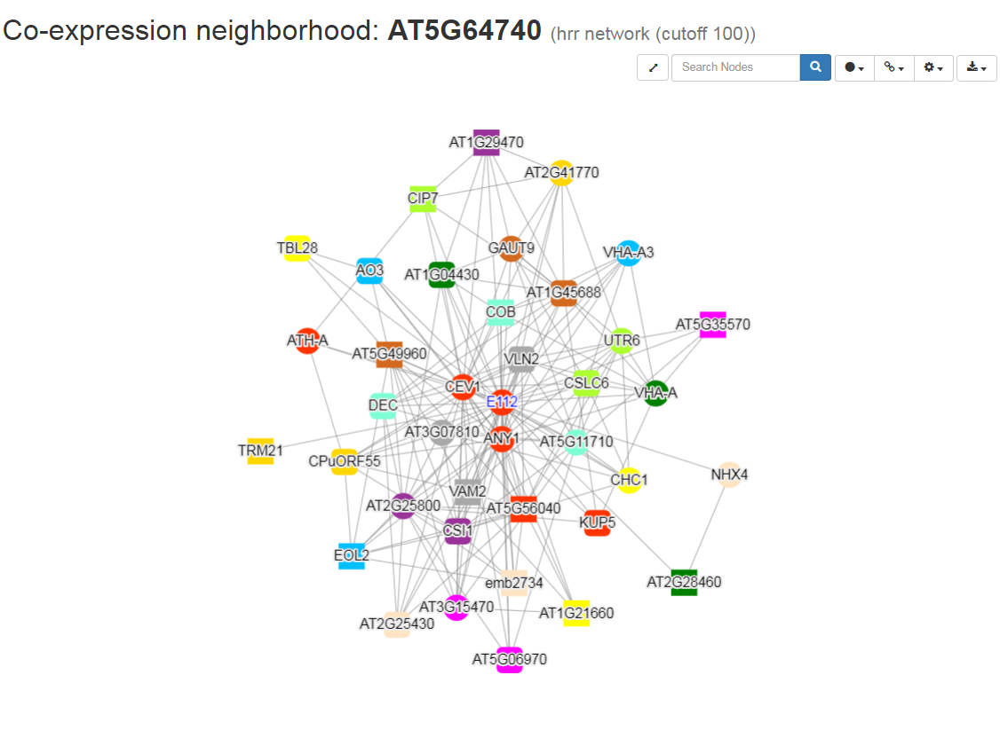

# Tutorial: Coexpression Networks and Clusters

## Coexpression intro

Genes which display a similar expression profile across many samples are considered co-expressed. As co-expression is
often attributed to a shared regulatory mechanism, co-expressed genes are likely to be involved in the same biological
process. 

 

In the example two profiles of co-expressed genes are show, the strength of their co-expression is indicated by the 
[Pearson Correlation Coefficient](https://en.wikipedia.org/wiki/Pearson_correlation_coefficient) (PCC) which is 
determined taking all samples into account (not just the ones included inthe profile)

## Navigating Coexpression Neighborhoods

A gene's coexpressed genes (referred to as the coexpression neighborhood) can be found on the sequence page.  

 can be used to access a table with details on all 
coexpressed genes. The network icon  lead to a network graph
visualized using [Cytoscape.js](http://js.cytoscape.org/) of the gene and its coexpression neighborhood.
 
 

You are able to pan (by dragging) and zoom (by scrolling) the graph. Node can be selected and moved by dragging.
Furthermore on the top-right corner there is a control bar.

From left to right, there is the "Reset View button" which will zoom the graph to fit the window. The search box where
a gene ID, IntePro domain or GO term can be entered to highlight all matching genes, then there is the Node, edge and 
layout controls which can be used to change the appearance of the nodes, edges and layout repectively. The right-most
button is the export button which allow you to export the graph as an image (PNG and SVG are supported) or to a format
which can be loaded in third party (XGMML) tools for local analysis.

## Coexpression Clusters 